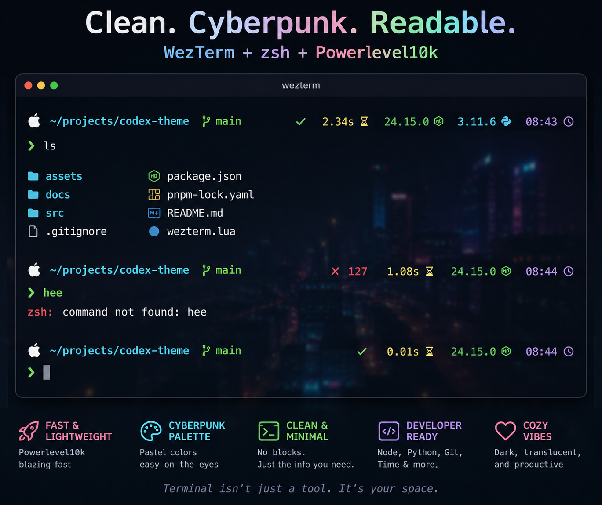

# Recreate My Cyberpunk WezTerm + Powerlevel10k Setup

A reusable AI prompt for recreating a cozy cyberpunk terminal setup with WezTerm, zsh, Powerlevel10k, transparent prompt segments, and a dark neon city backdrop.

The style:

- Dark translucent WezTerm background
- Subtle cyberpunk city backdrop
- Pastel cyberpunk colors
- Nerd Font icons
- Transparent Powerlevel10k prompt segments
- White app/OS icon
- Cyan path text
- Green git branch
- Green prompt arrow
- Green success status, pink error status
- Warm yellow command duration
- `NodeJS` and `PYTHON` runtime version labels
- Pastel runtime versions and lavender time
- Hidden hostname/context for a cleaner right prompt

## How To Use

Copy the prompt from [PROMPT.md](PROMPT.md), paste it into Codex, and let Codex inspect and update your local terminal config safely.

The prompt asks Codex to:

- Detect the active prompt system
- Prefer Powerlevel10k when present
- Update `~/.p10k.zsh` and `~/.wezterm.lua` when appropriate
- Back up existing config files before editing
- Preserve unrelated shell customizations
- Show diffs after changes
- Run syntax checks

## What You Need

This repo is meant to be used with an AI coding agent. Paste [PROMPT.md](PROMPT.md) into one of these tools and let it inspect, install, and configure the setup for your machine:

- [OpenAI Codex](https://openai.com/codex/)
- [Claude Code](https://www.anthropic.com/claude-code)

The prompt may install or configure tools like:

- [WezTerm](https://wezfurlong.org/wezterm/)
- zsh
- [Powerlevel10k](https://github.com/romkatv/powerlevel10k)
- MesloLGS Nerd Font Mono or another Nerd Font
- Optional shell helpers such as `eza`, `zoxide`, `zsh-autosuggestions`, and `zsh-syntax-highlighting`

You do not need to follow a manual install guide from this README. The point is to let the AI agent read your current setup, back it up, and make the safest changes for your environment.

## License

MIT. Use it, remix it, ship it, make your terminal feel like home.
