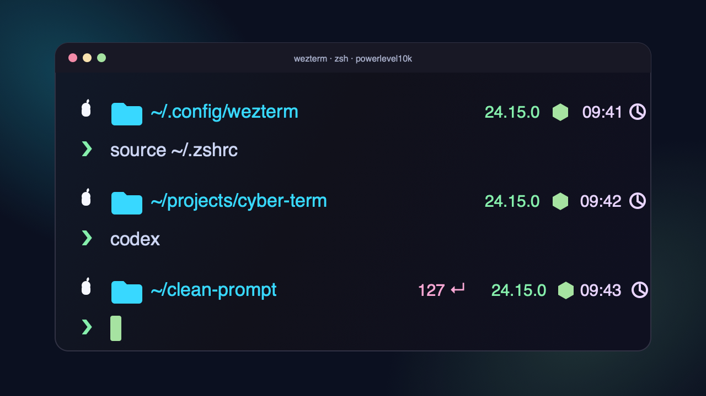

# Recreate My Clean Cyberpunk WezTerm + Powerlevel10k Setup

A reusable Codex prompt for recreating a clean, cozy cyberpunk terminal setup with WezTerm, zsh, and Powerlevel10k.

The style:

- Dark translucent WezTerm background
- Pastel cyberpunk colors
- Nerd Font icons
- Transparent Powerlevel10k prompt segments
- White app/OS icon
- Cyan path text
- Green prompt arrow
- Pastel status, version, duration, and time text
- Hidden hostname/context for a cleaner right prompt

## How To Use

Copy the prompt from [PROMPT.md](PROMPT.md), paste it into Codex, and let Codex inspect and update your local terminal config safely.

The prompt asks Codex to:

- Detect the active prompt system
- Prefer Powerlevel10k when present
- Update `~/.p10k.zsh` and `~/.wezterm.lua` when appropriate
- Back up existing config files before editing
- Preserve unrelated shell customizations
- Show diffs after changes
- Run syntax checks

## Recommended Tools

- [WezTerm](https://wezfurlong.org/wezterm/)
- zsh
- [Powerlevel10k](https://github.com/romkatv/powerlevel10k)
- A Nerd Font such as MesloLGS Nerd Font Mono

## License

MIT. Use it, remix it, ship it, make your terminal feel like home.
